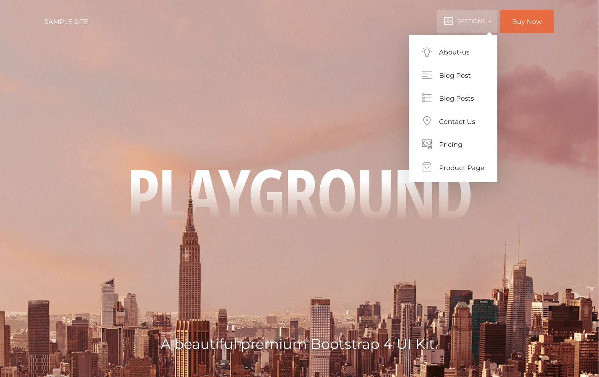

# Python Flask playwright Docker app playground

This is a skeleton for an HTTP service based on the Python Flask 3.x framework.

It includes :

- Docker-compose configuration file
- View configuration to serve http content
- pyTest configuration to write unit tests
- Python Playwright for automating and testing web applications.

## Prerequisite

- Unix environment like Debian 10 or Mac OS 10.15 (not tested on Windows)
- Docker or Docker Desktop (started with version V.4.x CE)
- Docker-compose (included with Docker Desktop)
- Git

Install [Docker Desktop](https://www.docker.com/products/docker-desktop)

## Install

Open your terminal and create a project folder

```
cd <project-folder>
git clone git@github.com:k3z/Playground-Docker-Python-Flask-playwright.git .
```

## Start project with Docker

### Build docker image

```sh
$ docker-compose build
```

### Start docker container

```sh
$ docker-compose up -d
```

### Check if service is running

```sh
$ docker-compose ps
```

Output

```
api       api:latest     "flask run --host=0.…"   api       4 hours ago   Up 1 second   0.0.0.0:5001->5000/tcp
nginx     nginx:latest   "/docker-entrypoint.…"   nginx     4 hours ago   Up 1 second   0.0.0.0:80->80/tcp
```

Go to http://127.0.0.1

### Restart docker container

```
$ docker-compose restart
```

### Stop docker container

```
$ docker-compose down
```

## How to use playwright

For conveniance, a sample site based on a rich featured bootstrap template is included (./nginx/static/example01).
You can check if setup is complete with a simple cli command.



```sh
$ docker-compose exec api flask app playwright
```

This command simulates the behavior of a user opening a navigation menu and clicking to open the "Contact Us" page.

```python
import re
from playwright.sync_api import sync_playwright
from playwright.sync_api import expect

with sync_playwright() as playwright:
    browser = playwright.chromium.launch(headless=True)
    page = browser.new_page()

    # Use default nginx vhost to locate sample website
    page.goto("http://nginx/")

    # check if meta title contain "Creative"
    expect(page).to_have_title(re.compile("Creative"))

    # Open example menu by click
    page.locator("#examples-nav").click()

    # Go to contact us page
    page.locator("#contact-us").click()
```

## Run Tests

Later you can add somme fonctional tests.

### Run all tests

```
$ docker-compose exec app pytest ./tests -v -s
```

### Run specific module tests

```
$ docker-compose exec app pytest ./tests/test_hello.py -v -s
```

### Run specific module method tests

```
$ docker-compose exec app pytest ./tests/test_hello.py::test_hello_world -v -s
```
